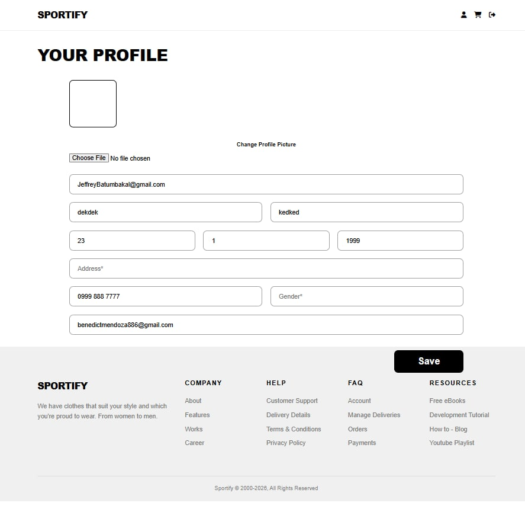
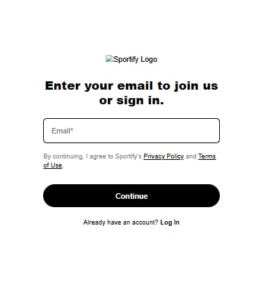
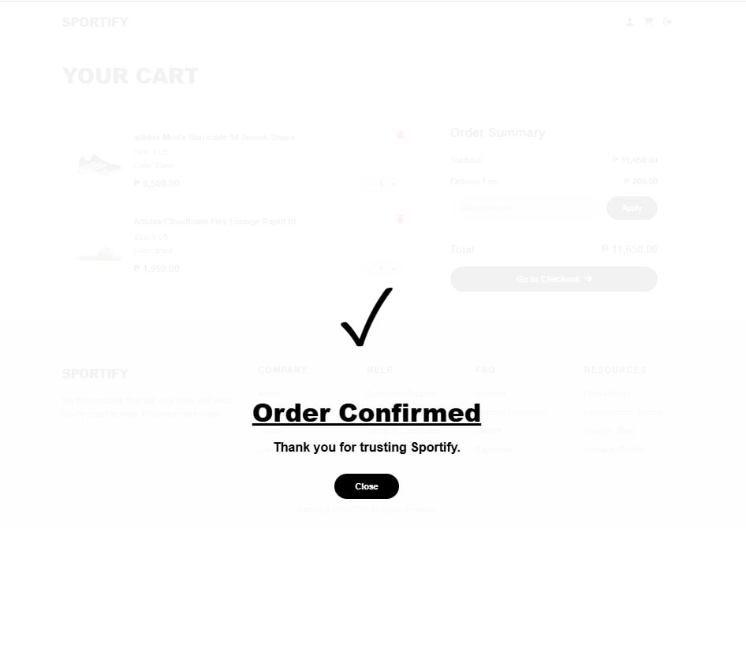
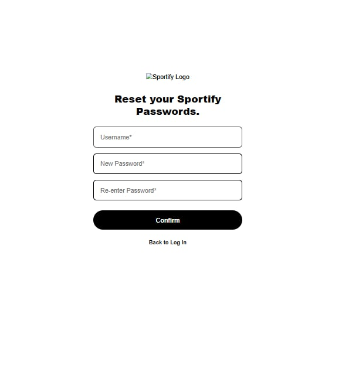
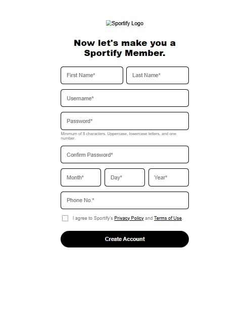
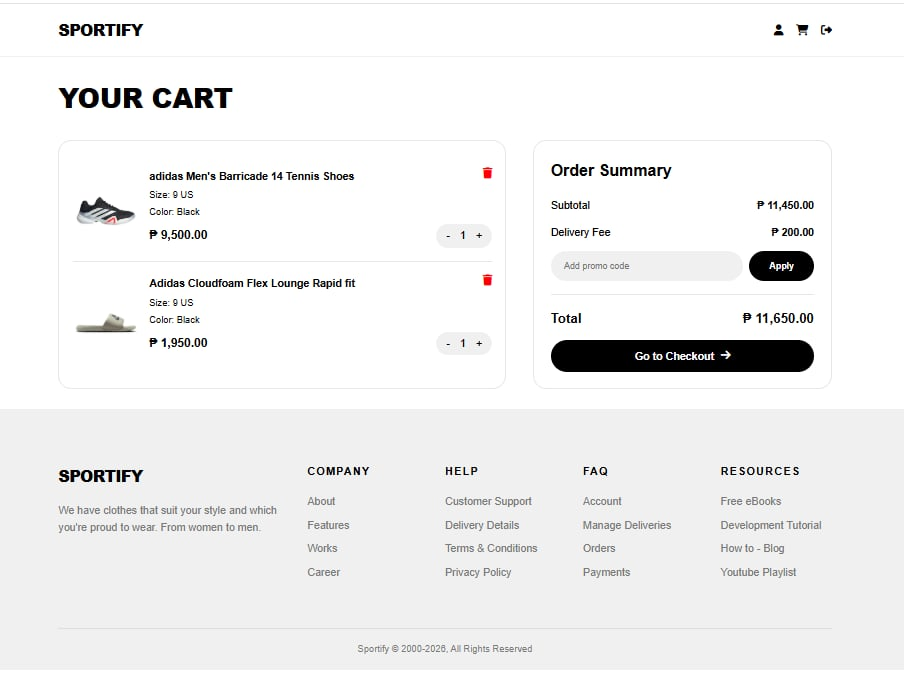
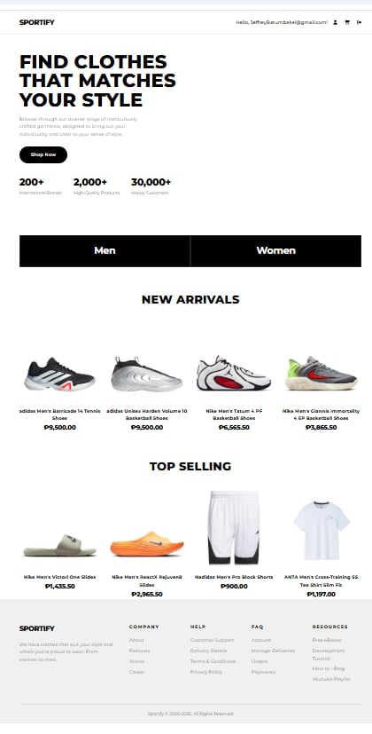
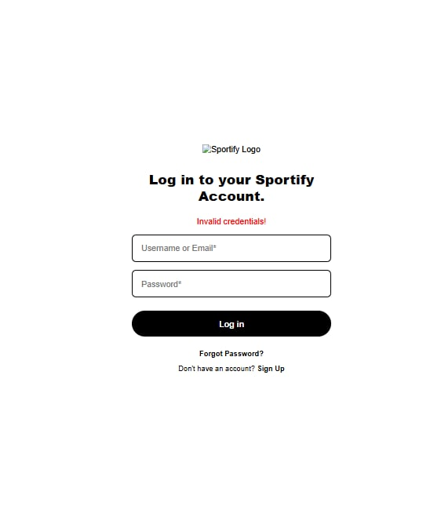

# 🏃 Sportify — Premium Sports & Lifestyle E-Commerce

## Description

Sportify is a full-stack PHP web application that serves as an online storefront for premium sports apparel and footwear. It provides users with a seamless shopping experience — from account registration and login, to browsing products, managing a cart, and updating a personal profile. The system is designed with a clean, modern black-and-white aesthetic inspired by leading sportswear brands.

---

## Features

- **Two-Step Registration** — Users first enter their email, then complete their full profile details on a second page.
- **Secure Login** — Authenticate using either a username or email address.
- **Password Reset** — Users can reset their password via the Forgot Password page.
- **Homepage / Product Catalog** — Displays *New Arrivals* and *Top Selling* product sections with product images and prices.
- **Shopping Cart** — View selected items, adjust quantities, apply promo codes, and view an order summary with delivery fee.
- **Order Confirmation** — A confirmation overlay is shown upon checkout.
- **User Profile Management** — Users can update their username, full name, birthday, address, phone number, gender, email, and profile picture.
- **Session-Based Authentication** — Protected pages redirect unauthenticated users back to the login page.
- **Logout** — Safely destroys the session and redirects to login.

---

## Technologies Used

| Layer | Technology |
|---|---|
| Frontend | HTML5, CSS3, PHP (templating) |
| Styling | Custom CSS (`style.css`, `styles.css`, `custom.css`), Google Fonts (Montserrat), Font Awesome 6 |
| Backend | PHP 8+ |
| Database | MySQL (via PDO) |
| Server | Apache / XAMPP (localhost) |

---

## Installation / Setup Guide

### Prerequisites
- [XAMPP](https://www.apachefriends.org/) (or any Apache + PHP + MySQL stack)
- A modern web browser

### Steps

1. **Clone or download** this repository into your XAMPP `htdocs` folder:
   ```
   C:/xampp/htdocs/sportify/
   ```

2. **Start Apache and MySQL** from the XAMPP Control Panel.

3. **Create the database** by opening [phpMyAdmin](http://localhost/phpmyadmin) and creating a new database named:
   ```
   messi
   ```
   > The `users` table will be created **automatically** on first run via `dbconfig.php`.

4. **Configure the database** (if needed) by editing `dbconfig.php`:
   ```php
   $dbservername = "localhost";
   $dbusername   = "root";
   $dbpassword   = "";       // Change if your MySQL has a password
   $dbname       = "messi";
   ```

5. **Create an uploads folder** in the project root for profile pictures:
   ```
   sportify/uploads/
   ```

6. **Launch the app** by navigating to:
   ```
   http://localhost/sportify/
   ```
   You will be redirected to the Sign Up page automatically.

---

## Screenshots

 
 
 
 
 
 
 


| Page | Description |
|---|---|
| `signup1.php` | Email entry — Step 1 of registration |
| `signup2.php` | Full account details — Step 2 of registration |
| `login.php` | User login screen |
| `homepage.php` | Product catalog with New Arrivals & Top Selling |
| `cart.php` | Shopping cart and order summary |
| `profile.php` | User profile editor with photo upload |
| `forgot.php` | Password reset page |

---

## Project Structure

```
sportify/
├── index.php          # Entry point — redirects to signup1.php
├── signup1.php        # Registration Step 1 (email)
├── signup2.php        # Registration Step 2 (full details)
├── login.php          # Login page
├── logout.php         # Session destroy & redirect
├── forgot.php         # Password reset
├── homepage.php       # Main product page (protected)
├── cart.php           # Shopping cart (protected)
├── profile.php        # User profile editor (protected)
├── dbconfig.php       # Database connection & table setup
├── css/
│   ├── style.css      # Homepage & layout styles
│   ├── styles.css     # Auth pages styles
│   └── custom.css     # Cart & profile styles
├── images/
│   └── logo.png       # Sportify logo
├── image/             # Product images (shoes, slides, shirts)
└── uploads/           # User-uploaded profile pictures
```

---

## Contributors

| Name |
|---|
| (Lyzander Jeptah C. Fabian)
| (Benedict M. Mendoza)
| (Ivan Matthew D. Sumilang)
| (Yza Paula M. Pascua)
| (Jean Fernando V. Orga)


---

> **Note:** This project currently uses MD5 for password hashing for academic/demo purposes. For production deployment, replace MD5 with `password_hash()` and `password_verify()` as recommended by PHP security best practices.
